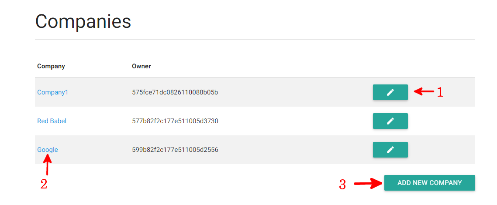
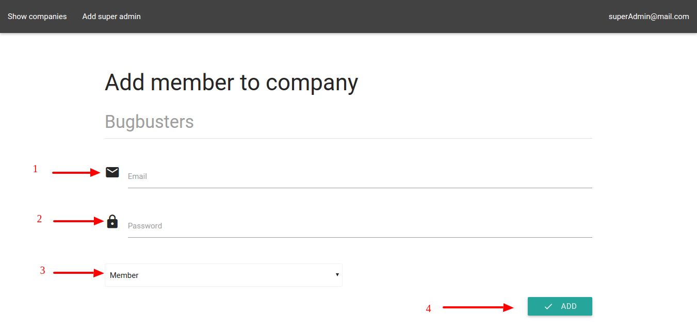

# Companies management
## Show all companies
The *Show Company* button in the menu bar allows you to give access to all companies recorded in MaaS. The list of companies will be shown in tabular form.

## Remove a company
Clicking on a company name, you can see the button to remove it from MaaS.

## Show company's members
To open this page, you need to click on the name of the company in the *Show Companies* page.
The list of members will be shown in tabular form.

## Add member to a company
To open this page, you need to click on the company's name in the *Show Companies* page and clicl on *Add member*. As illustrated in Figure 3, you will be asked to enter an e-mail (1) , a password (2), a rule (3) and click on the *Add* button (4). After add member process is finished, the super admin is redirected to the *Show companies* page. 

## Remove member from a company
To open this page, you need to click on the company's name in the *Show Companies* page and click on the button *Remove* next to the member in the list.

