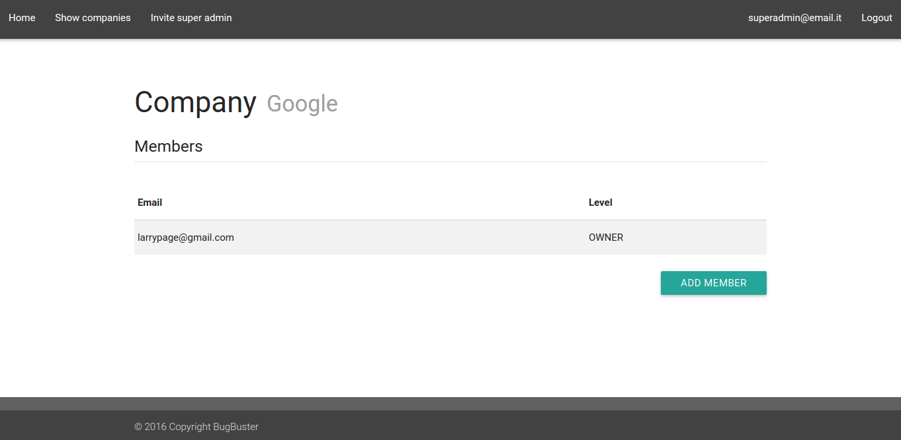

# Companies management
## Show all companies
The *Show companies* button in the menu bar allows you to give access to all companies recorded in MaaS. The list of companies will be shown in tabular form. In this page you can see, for each company, the owner. You can also change the name of the company (1). A click on the name of a company (2) will redirect you to a page which contains the list of all the members of that company (see the "**Show company's members**" section for more details).

TODO immagine showCompanies.png

## Remove a company
By clicking on a company name, you can see the delete button that allows you to remove the company.

## Show company's members
To open this page, you need to click on the name of the company in the *Show Companies* page.
The list of members will be shown in tabular form. A click on "Add member" will redirect you to the *Add member* page, in witch you can add a member to the selected company. See the "**Add member to a company**" page for more details.

## Add member to a company
To open this page, you need to click on the name of the company in the *Show Companies* page and click on *Add member*. As illustrated in figure below, you will be asked to enter an e-mail (1) , a password (2), a role (3) and click on the *Add* button (4). When this operation has been completed, the super admin is redirected to the *Show companies* page. 

## Remove member from a company
To open this page, you need to click on the company's name in the *Show Companies* page and click on the button *Remove* next to the member in the list.

